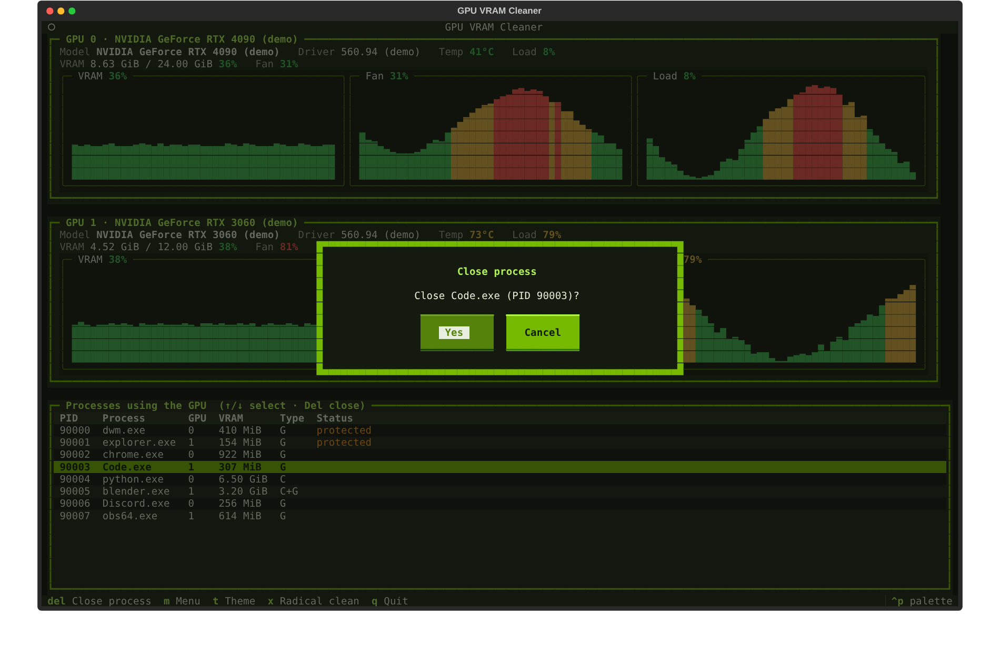
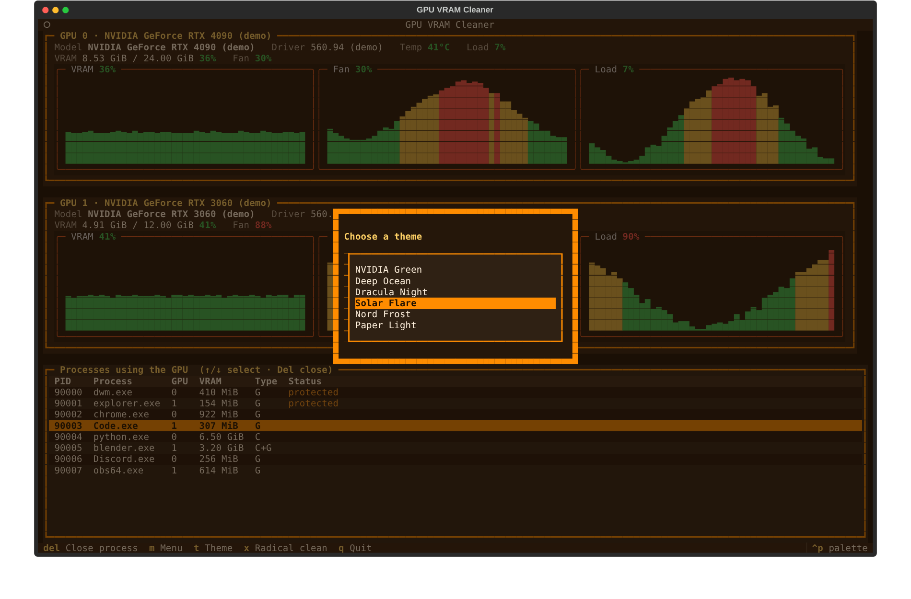

# GPU VRAM Cleaner

A terminal UI (Textual + colorama) for Windows Terminal / PowerShell that shows every NVIDIA GPU in the
system and the processes holding its VRAM, and lets you close them to free memory.



## Features

- One panel per GPU with model, driver version, temperature (°C), load and VRAM used/total.
- Three live graphs per GPU, refreshed every second: **VRAM %**, **fan %** and **load %**.
- Percentages and temperatures change color with their level (green / yellow / red):

  | Reading      | Green  | Yellow   | Red     |
  |--------------|--------|----------|---------|
  | VRAM, load   | < 60 % | 60–84 %  | ≥ 85 %  |
  | Fan          | < 50 % | 50–79 %  | ≥ 80 %  |
  | Temperature  | < 65 °C| 65–79 °C | ≥ 80 °C |

- Process list: move with **↑ / ↓**, press **Del** to get a *Close process* confirmation with **Yes**
  (selected by default) and **Cancel** (use ← / → to switch, Enter to confirm, Esc to cancel).
- Menu (**m**) with:
  - **Change theme**: 6 color themes for borders and backgrounds (NVIDIA Green, Deep Ocean, Dracula Night,
    Solar Flare, Nord Frost, Paper Light). Themes preview live as you move; the choice is saved.
  - **Radical clean**: closes every process using VRAM in one go, after a confirmation (Cancel is the
    default there).



## Keeping Windows safe

Both the single close and the radical clean refuse to touch processes that Windows needs, so the desktop,
login session and drivers keep working:

- core system processes (`System`, `csrss.exe`, `wininit.exe`, `winlogon.exe`, `services.exe`, `lsass.exe`,
  `svchost.exe`, `dwm.exe`, `explorer.exe`, `sihost.exe`, `ctfmon.exe`, shell hosts, NVIDIA display
  container, ...);
- anything running as `SYSTEM`, `LOCAL SERVICE` or `NETWORK SERVICE`, or that the app cannot inspect;
- the app itself and its parent processes (the PowerShell and Windows Terminal running it).

Protected rows are marked `protected` in the list. Everything else that holds VRAM (games, browsers,
Python/CUDA jobs, Blender, OBS, Discord, ...) is closed: first politely (`terminate`), then forcefully
(`kill`) if it does not exit within 3 seconds. Closing processes owned by other users requires running the
terminal as administrator.

## Install and run

Requires [uv](https://docs.astral.sh/uv/) and an NVIDIA GPU with its driver installed (NVML ships with it).

```powershell
git clone https://github.com/andriusland/GPU-VRAM-Cleaner
cd GPU-VRAM-Cleaner
uv run gpu-cleaner
```

Options:

```text
--demo          simulated GPUs and processes (nothing real is closed); handy without an NVIDIA card
--interval S    refresh interval in seconds (default 1)
```

Keys: `↑/↓` select · `Del` close process · `m` menu · `t` theme · `x` radical clean · `q` quit.

> On Windows, per-process VRAM usage may show `N/A`: under the WDDM driver model NVML often cannot report it.

## Development

The project was built test first (red → green → refactor).

```powershell
uv run pytest          # tests (core logic + Textual UI driven with a fake GPU provider)
uv run ruff check .    # lint
uv run ruff format .   # format
```

Layout (`src/gpu_vram_cleaner/`):

| Module          | Responsibility                                                    |
|-----------------|-------------------------------------------------------------------|
| `provider.py`   | `NvmlGpuProvider` (real GPUs via nvidia-ml-py) and `DemoGpuProvider` |
| `models.py`     | `GpuInfo`, `GpuProcess`                                           |
| `levels.py`     | thresholds and colors for percentages and temperatures            |
| `history.py`    | rolling sample buffer for the graphs                              |
| `graph.py`      | pure text rendering of the bar graphs                             |
| `protection.py` | which processes must never be closed                              |
| `killer.py`     | closing processes with psutil, radical clean planning             |
| `themes.py`     | the six themes and saving the chosen one                          |
| `app.py`        | the Textual app, dialogs and menus                                |
